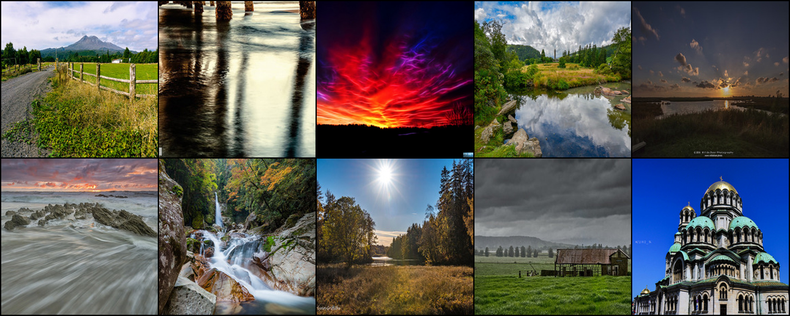
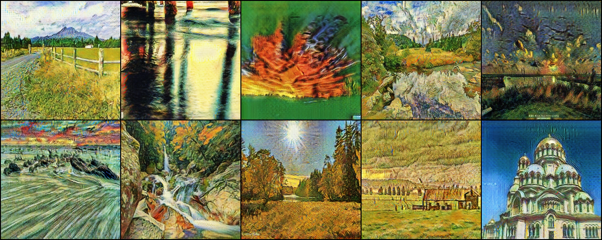

# Photo2VanGogh

Turn your photos into amazing artworks in the style of Vincent van Gogh with our Photo2VanGogh. This project uses the CycleGAN deep learning model to add van Gogh's unique brushstrokes and colors to your pictures.

  
  

