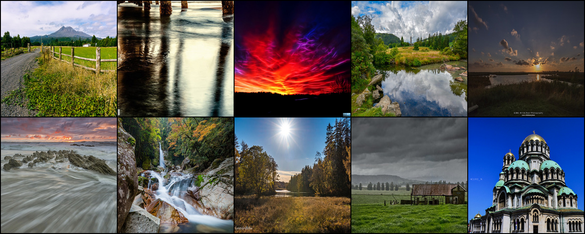
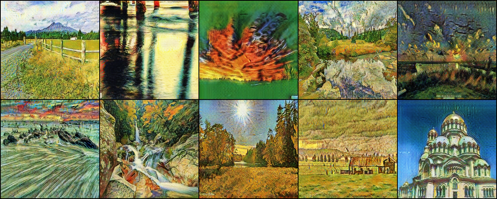

# Photo2VanGogh

Turn your photos into amazing artworks in the style of Vincent van Gogh with our Photo2VanGogh. This project uses the CycleGAN deep learning model to add van Gogh's unique brushstrokes and colors to your pictures.




## Requirements

This project requires Python 3.7 or above. To install the necessary dependencies, you can use the `requirements.txt` file.

Install the dependencies by running:

```sh
pip install -r requirements.txt
```

## Transforming Photos to Van Gogh Style

To transform your photos into the Van Gogh style, follow these steps:

1. **Download the model weights**:
   Download the model weights from [this Google Drive link](https://drive.google.com/file/d/1LS9hi2JXpZMaq2OVzic8gCqKTt9mzNGx/view?usp=sharing).

2. Create a directory for your images:

   ```sh
   mkdir images
   ```

3. Add the images you want to transform into the `images` directory.

4. Create a directory for the results:

   ```sh
   mkdir results
   ```

   This is where the output images will be stored.

5. Make the `generate_image` script executable:

   ```sh
   chmod +x ./generate_image
   ```

6. Run the `generate_image` script with the appropriate options:

   ```sh
   source ./generate_image --weightsFile <weightsfile name> --n_cpu <number of cpus> [--cuda <if gpu available>]
   ```

   Replace `<weightsfile name>` with the name of your weights file, `<number of cpus>` with the number of CPUs you want to use default is 1, and optionally include `--cuda` if you have a GPU available.

By following these instructions, you can easily transform your photos into stunning artworks inspired by Vincent van Gogh.
